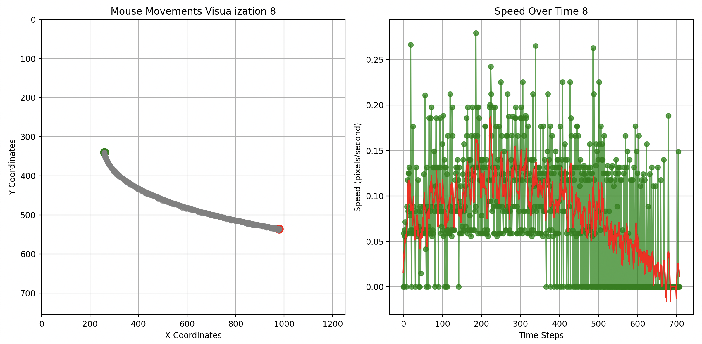

# Anthropic Computer Use (for Mac)

This is a fork of [mac_computer_use from Deedy](https://github.com/deedy/mac_computer_use)
This Version has humanlike mouse movements added, as well as human like typing on textfields/input. Scrolling per scrollwheel will also be added. For all these additions, we are using other already existing Librarys, wich mimic the Human Input.

Example Humanlike mouse movement: 


[Anthropic Computer Use](https://github.com/anthropics/anthropic-quickstarts/blob/main/computer-use-demo/README.md) is a beta Anthropic feature which runs a Docker image with Ubuntu and controls it. This fork allows you to run it natively on macOS, providing direct system control through native macOS commands and utilities.

> [!CAUTION]
> This comes with obvious risks. The Anthropic agent can control everything on your Mac. Please be careful.
> Anthropic's new Claude 3.5 Sonnet model refuses to do unsafe things like purchase items or download illegal content.

## Features

- Native macOS GUI interaction (no Docker required)
- Screen capture using native macOS commands
- Keyboard and mouse control through cliclick
- Multiple LLM provider support (Anthropic, Bedrock, Vertex)
- Streamlit-based interface
- Automatic screen resolution scaling
- File system interaction and editing capabilities

## Prerequisites

- macOS Sonoma 15.7 or later
- Python 3.12+
- Homebrew (for installing additional dependencies)
- cliclick (`brew install cliclick`) - Required for mouse and keyboard control

## Setup Instructions

1. Clone the repository and navigate to it:

```bash
git clone https://github.com/deedy/mac_computer_use.git
cd mac_computer_use
```

2. Create and activate a virtual environment:

```bash
python3.12 -m venv venv
source venv/bin/activate
```

3. Run the setup script:

```bash
chmod +x setup.sh
./setup.sh
```

4. Install Python requirements:

```bash
pip install -r requirements.txt
```

5. Add human_typer Folder to venv/.../lib as a module

## Running the Demo

### Set up your environment and Anthropic API key

1. In a `.env` file add:

```
API_PROVIDER=anthropic
ANTHROPIC_API_KEY=<key>
WIDTH=800
HEIGHT=600
DISPLAY_NUM=1
```

Set the screen dimensions (recommended: stay within XGA/WXGA resolution), and put in your key from [Anthropic Console](https://console.anthropic.com/settings/keys).

2. Start the Streamlit app:

```bash
streamlit run streamlit.py
```

The interface will be available at http://localhost:8501

## Screen Size Considerations

We recommend using one of these resolutions for optimal performance:

-   XGA: 1024x768 (4:3)
-   WXGA: 1280x800 (16:10)
-   FWXGA: 1366x768 (~16:9)

Higher resolutions will be automatically scaled down to these targets to optimize model performance. You can set the resolution using environment variables:

```bash
export WIDTH=1024
export HEIGHT=768
streamlit run streamlit.py
```

> [!IMPORTANT]
> The Beta API used in this reference implementation is subject to change. Please refer to the [API release notes](https://docs.anthropic.com/en/release-notes/api) for the most up-to-date information.
